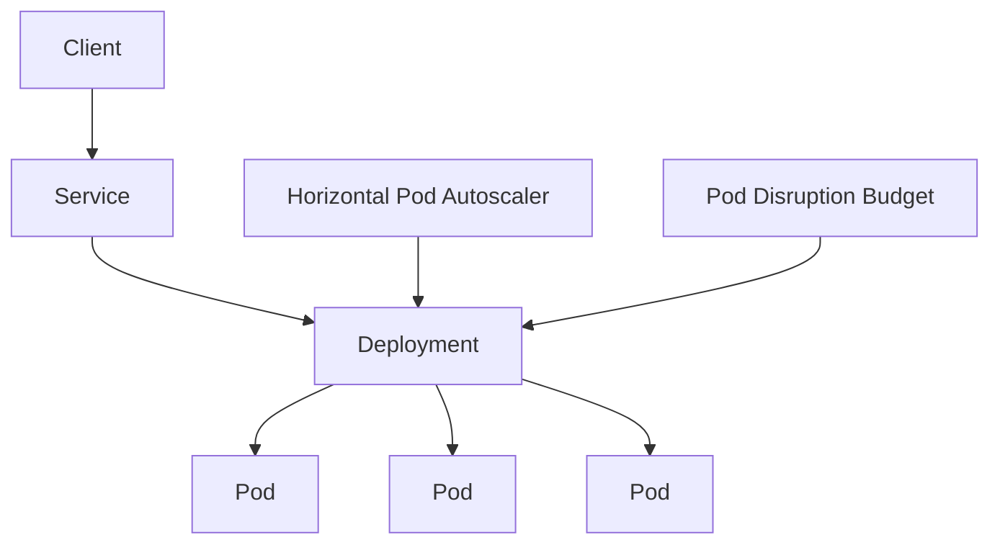

# Kubernetes Resilient Application Platform

A production-oriented Kubernetes manifest set focused on application availability, controlled rollouts, health monitoring, and horizontal scaling.

## Architecture


## Reliability features
- Three baseline replicas
- RollingUpdate deployment strategy
- Readiness and liveness HTTP probes
- CPU and memory requests/limits
- ClusterIP service abstraction
- CPU-based Horizontal Pod Autoscaler
- Pod Disruption Budget for voluntary disruptions

## Skills demonstrated
Kubernetes • Container Orchestration • Reliability • Autoscaling • YAML • Production Operations

## Deploy
Replace `ghcr.io/OWNER/portfolio-api:latest` in the Deployment with an image you control.

```bash
kubectl apply -f k8s/
kubectl get deployments,pods,svc,hpa,pdb
```

## Troubleshooting examples
```bash
kubectl describe deployment portfolio-api
kubectl get events --sort-by=.metadata.creationTimestamp
kubectl logs -l app=portfolio-api --tail=100
```

This is a portfolio implementation and does not claim a live production cluster.
